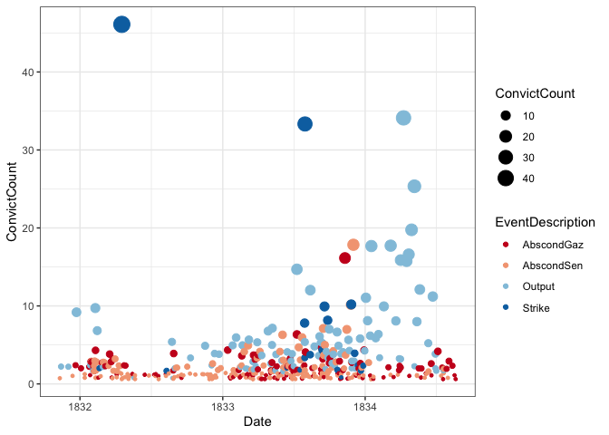

The Notman’s Road Gang Network Visualisations
================
Code maintained by Monika Schwarz
2026-02-11

# Background

The Notman gang was a convict gang operating in Van Diemen’s Land
between 1830 and at least 1837. It was a gang convicts were sent to as a
form of secondary punishment. The period between 1830-34 in the gang is
marked by an astonishing amount of convict collusion, expressed in
abscondings, strikes and other actions that reduced the output of the
gang. The collective resistance of these convicts can be visualised in a
network.

The dataset used here was collated by Hamish Maxwell-Stewart and Michael
Quinlan. It records all offence records in the convict records (CON)
relating to the Notman gang, verified with the Launceston bench books
recorded by the police (POL). It also includes absconding notices
mentioning the Notman gang which were published in the Hobart Town
Gazette. In the dataset gazetted abscondings, shortened into AbscondGaz,
are distinguished from sentenced abscondings, aka AbscondSen, which were
recorded in the convict and police records.

This R Markdown file was created to demonstrate our use of an R script
to visualise convict resistance. The resulting visualisations have been
used in our publications:

- Schwarz, Monika; Maxwell-Stewart, Hamish and Quinlan Michael. “Trouble
  on the Roads: Using Digital Techniques to Explore Convict Protest in
  Van Diemen’s Land.” Labour History, 129 (2025), 61-89.
- our upcoming article “Representing the Hydra: Using Digital
  Technologies to Visualise History from Below”.

``` r
library(readxl)
library(dplyr)
library(stringr)
library(ggplot2)
library(igraph)
```

## Load the dataset

``` r
notman <- read_xlsx("./NotmansRoadGang.xlsx", sheet = 1, skip = 1, 
                    trim_ws = TRUE, col_names = TRUE)

# remove 8 duplicates where Con and POL record the same sentence (which do not have an entry in the Order column)
notman <- notman %>%
  filter(!is.na(Order))
```

## Initial Exploration

Getting a feel for the data.

``` r
# How many convicts are recorded in the dataset?
convicts <- notman %>%
  group_by(ConvictId) %>%
  summarise(count = n(), .groups = 'drop')

nrow(convicts) # 408 individuals
```

    ## [1] 408

``` r
# What is the maximum amount of convictions for a convict in the Notman gang?
max(convicts$count)
```

    ## [1] 22

``` r
# From what sources is this data coming from?
sources <- notman %>%
  select(Source) %>%
   group_by(Source) %>%
  summarise(count = n(), .groups = 'drop')
sources
```

    ## # A tibble: 4 × 2
    ##   Source count
    ##   <chr>  <int>
    ## 1 CON      960
    ## 2 HTG      286
    ## 3 POL      424
    ## 4 <NA>       1

``` r
# How many collective events (with more than two convicts participating)?
events <- notman %>%
  filter(Collective == 3) %>%
  select(EventDescription, EventId) %>%
  group_by(EventDescription, EventId) %>%
  summarise(count = n(), .groups = 'drop') %>%
  select(EventDescription) %>%
  group_by(EventDescription) %>%
  summarise(count = n(), .groups = 'drop')
events
```

    ## # A tibble: 7 × 2
    ##   EventDescription count
    ##   <chr>            <int>
    ## 1 AbscondGaz          34
    ## 2 AbscondSen          33
    ## 3 Absent               4
    ## 4 Output              72
    ## 5 Strike              10
    ## 6 Theft                2
    ## 7 Violence             1

``` r
rm(convicts, sources, events)
```

## Creating the collective action timeline

``` r
# adding a Date to the dataset
notman$Date <- as.Date(notman$Xdate, "%d/%m/%Y")

# filter the dataset down to the relevant information
timeline <- notman %>%
  filter(EventDescription %in% c("AbscondGaz", "AbscondSen", "Output", "Strike")) %>%
  select(Date, EventId, EventDescription) %>%
  group_by(Date, EventId, EventDescription) %>%
  summarise(ConvictCount = n(), .groups = 'drop') %>%
  filter(ConvictCount >=1)

# custom colors!
cols <- c("#b2182b", "#f4a582", "#92c5de", "#2166ac")

# plot the events
plot <- ggplot(timeline[timeline$Date < "1834-08-30" & timeline$Date > "1831-08-30",], aes(x = Date, y = ConvictCount, size = ConvictCount, color = EventDescription)) +
  geom_jitter() +
  scale_color_brewer(palette = 'RdBu', direction = 1) +
  theme_bw()
plot
```

<!-- -->

``` r
rm(timeline, plot, cols)
```

## Creating the network visualisation

Preparing the dataset for the network visualisation.

``` r
# remove incidents involving less than 3 convicts
notmanNetwork <- notman %>%
  filter(Collective == 3)
notmanVec <- as.vector(notmanNetwork$EventId)
notmanNetwork <- notman %>%   
  filter(EventId %in% notmanVec)%>%
  select(EventId, ConvictId, EventDescription, `First name`, Surname, Date) %>%
  filter(!is.na(ConvictId))


# prepare for network transformation
notmanNetwork$Weight <- 1
notmanNetwork$Label <- paste(notmanNetwork$`First name`, notmanNetwork$Surname, sep=" ")
notmanNetwork$Label <- str_to_title(notmanNetwork$Label)
notmanNetwork$Incident <- paste('Id', notmanNetwork$EventId, sep ='')
notmanNetwork <- notmanNetwork %>% 
  select(-`First name`, -Surname) # those two columns are not needed anymore


# coloring the nodes correctly (apply 0 to incidents, 1 to convicts)
incidents <- notmanNetwork %>% 
  select(EventId, Incident) %>% 
  unique()

#add names to events
eventnames <- notmanNetwork %>%
  select(EventId, EventDescription) %>% 
  unique()
eventnames <- eventnames[!duplicated(eventnames$EventId),]
eventnames$EventDescription <- str_to_title(eventnames$EventDescription)

#add size
events <- notmanNetwork %>%
  group_by(EventId) %>%
  summarise(Count = n())
eventnames <- merge(events, eventnames, by = "EventId")
evs <- unique(eventnames$EventDescription)

incidents <- merge(incidents, eventnames, by = "EventId")
incidents$typus <- 0
incidents$Label <- incidents$Incident
incidents <- incidents %>% 
  select(Incident, typus, Label, EventDescription, Count)
colnames(incidents) <- c("Name", "typus", "Label", "Event", "Count")
rm(events, eventnames)


convicts <- notmanNetwork %>% select(ConvictId, Label) %>% unique() # create a unique look up table
convicts <- convicts[!duplicated(convicts$ConvictId),] # throw out names with different spellings
convicts <- convicts %>% filter(!is.na(ConvictId)) # throw out the name without the convict Id
convicts$typus <- 1
convicts$Event <- ""
convicts$Count <- 1
convicts <- convicts %>% select(ConvictId, typus, Label, Event, Count)
colnames(convicts) <- c("Name", "typus", "Label", "Event", "Count")
incidentnames <- rbind(incidents, convicts)


# reduce main data set to necessary columns
notmanNetwork2 <- notmanNetwork %>% select(Incident, ConvictId, Weight)
```

Preparing the variables for the visualisation and drawing the plot.

``` r
# define some variables for drawing the network
igraph_options(edge.arrow.size = 0, 
               vertex.color = "gray53",
               vertex.size = 1,
               vertex.frame.color = "gray53",
               vertex.label.color = "gray12",
               vertex.label.family = "Helvetica",
               vertex.label.dist = 0.0,
               vertex.label.degree = pi/2,
               vertex.label.cex = 6)

# define custom colors for the network
cols <- c("#b2182b", "#f4a582", "#92c5de", "#fee08b", "#2166ac", "#1a9850", "#a6d96a" )


# create graph, vertices colored by incident name list
g <- graph_from_data_frame(notmanNetwork2, vertices = incidentnames, directed = FALSE)
g <- simplify(g)

# add color and labels to the nodes
V(g)$color <- cols[match(V(g)$Event, evs)]
V(g)$color <- ifelse(!is.na(V(g)$color), V(g)$color, "white")
V(g)$label <- V(g)$Label
E(g)$color <- "gray10"

# add sized event nodes in graph
V(g)$size <- ifelse(!is.na(V(g)$Count), V(g)$Count/1.5, 1)
# choose a layout
lay <- layout_nicely(g) 

# plot the graph
plot <- plot.igraph(g,layout=lay, edge.width=E(g)$weight)

# add a legend
legend('topright', legend = evs, fill = cols, cex = 6)
```

<!-- -->

The network connects individual convicts with collective actions, with
the size and color of the nodes indicating their magnitude and nature of
the events. That all collective action at Notman’s plots into one big
graph with only 7 events not being connected, shows the collusive nature
of the convict actions.

## Identify subsections of the network

Here we are using edge betweenness to split the main graph into three
sections. Our research showed that the resulting separate sections
correspond with an early, a middle and a late phase of resistance at
Notman’s gang, all marked by different patterns of resistance. For
example, the early phase consisted of small scale events up until a
large strike (ID103), the middle phase is dominated by strikes and
absconding attempts, whereas the late phase consisted of a series of
output reducing actions.

``` r
# detect communities through edge betweenness (measures the number of shortest path through an edge, so if you stepwise remove the highest scoring edges you get separate modules of the graph)
eb <- cluster_edge_betweenness(g)

# cut the memebership at 10 communities (which separates the 7 unconnected nodes out and splits the main graph into three parts )
eb$membership <- cut_at(eb, 10) # 10 communities

# plot
plot(eb, g,
     vertex.label = V(g)$id,  # Uses index number instead of name
     layout = lay, 
     main="Ten-Community Solution")
```

<!-- -->

## Magistrates

The Notman story is not just one of convicts and overseers. The
magistrates at the bench sentencing the convicts after their breaches of
conduct play a role, too. For example, the last phase in the network
falls exclusively into the time period where only one magistrate, Ronald
Campbell Gunn, decides on rather mild sentences.

``` r
# Magistrates also sat in pairs or groups of 3 and 4. We have to row bind all magistrates and sentence dates into one column, filter for NAs and undetermined, then remove the new  data frames again.
mag1 <- notman %>%
  select(Magistrate1, Date, Month, Year) %>%
  rename(Magistrate = Magistrate1) %>%
  filter(!is.na(Magistrate))
mag2 <- notman %>%
  select(Magistrate2, Date, Month, Year) %>%
  rename(Magistrate = Magistrate2) %>%
  filter(!is.na(Magistrate))
mag3 <- notman %>%
  select(Magistrate3, Date, Month, Year) %>%
  rename(Magistrate = Magistrate3) %>%
  filter(!is.na(Magistrate))
mag4 <- notman %>%
   select(Magistrate4, Date, Month, Year) %>%
  rename(Magistrate = Magistrate4) %>%
  filter(!is.na(Magistrate))
mags <- rbind(mag1, mag2, mag3, mag4)
rm(mag1, mag2, mag3, mag4)

mags <- mags %>%
  filter(Magistrate != "undetermined")

# bin dates into month to have a clearer outcome
mags2 <- mags %>%
  select(Month, Year, Magistrate) %>%
  group_by(Month, Year, Magistrate) %>%
  summarise(SentenceCount = n())
mags2$YearMonth <- zoo::as.yearmon(paste(mags2$Year, mags2$Month), "%Y %m")

# find the most common magistrates and create a vector
mags3 <- mags %>%
  select(Magistrate) %>%
  group_by(Magistrate) %>%
  summarise(count = n()) %>%
  arrange(count) %>%
  filter(count >= 50)
commonMags <- as.vector(mags3$Magistrate)

# scale down to the top 5 magistrates
mags4 <- mags2 %>%
  filter(Magistrate %in% commonMags)
mags4$Magistrate <- factor(mags4$Magistrate,
                       levels = c('Ronald Campbell Gunn', 'Matthew Curling Friend', 'George Stephen Davies', 'William Kenworthy', 'William Lyttleton' ),ordered = TRUE)

# plot
ggplot(mags4, aes(x = YearMonth, y = Magistrate, fill = Magistrate)) +
  geom_boxplot() +
  xlab("Sentence Date") +
  scale_fill_brewer(palette = "BrBG") +
  theme_bw()
```

<!-- -->
